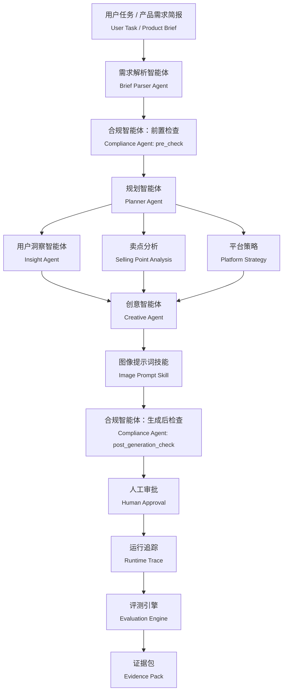

# 电商增长智能体工作台

<sub>E-commerce Growth Agent Studio</sub>

> 面向人工智能内容工作流的企业级智能体运行与评测平台
>
> <sub>Enterprise Agent Runtime & Evaluation Platform for AI-powered Content Workflow</sub>

面向企业内容生产场景的智能体运行、工作流编排、运行追踪、评测与治理参考实现。它不展示一个普通聊天机器人，也不把“一次生成文案”包装成企业级能力；重点是让多智能体工作流的输入、决策、风险、人工审批和评测证据可以被追踪、复核与迭代。


<a href="http://127.0.0.1:4173/portfolio/?v&#61;20260720-runtime-final#top">查看完整项目演示</a> · [工作流设计](workflow/agent_workflow.md) · [I/O 契约](workflow/agent_io_contracts.md) · [证据包](outputs/portfolio_evidence_pack.md)

## 项目背景

<sub>Why</sub>

企业内容生产的瓶颈通常不在于模型能否写出一段文字，而在于生成结果如何进入可控的业务流程：

| 真实问题 | 对 Agent 系统的要求 |
| --- | --- |
| 需求输入不规范，商品信息、目标人群和授权材料容易缺失 | 先标准化 Brief，并用 Schema 在入口阻断关键缺失字段 |
| 用户洞察、卖点、平台策略和创意规划由不同角色协作 | 按职责拆分 Agent / Skill，定义稳定的 Input / Output Contract |
| Agent 的推理与路由过程难解释 | 记录节点路径、产物引用、风险关联与失败位置，而不是只保留最终答案 |
| 输出质量与风险无法统一衡量 | 将任务完成、结构质量、风险控制和证据覆盖纳入 Evaluation Framework |
| 品牌、法务和运营不能把发布责任交给模型 | 设置 Human-in-the-loop、Risk ID、Approval Gate 和可回退的修订路径 |

因此，本项目关注的不是“生成得更快”，而是把企业内容生产拆解为可运行、可观察、可评估、可治理的 Agent Workflow。

## 项目简介

<sub>Project Overview</sub>

从 0 到 1 设计企业电商内容生产多 Agent 工作台，将下列业务链路封装为结构化工作流：

```text
Product Brief
  → User Insight
  → Selling Point Analysis
  → Creative Planning
  → Compliance Review
  → Human Approval
  → Performance Evaluation
```

默认 Demo 场景为“运动相机新品上市营销任务”。系统产出的是可审批的创意规划与证据包，而非可直接公开发布的最终营销文案、最终图片 Prompt 或图片资产。

当前实现中，Agent 的职责边界、产物 Schema、双阶段合规、人工审批、失败恢复测试和证据引用均已沉淀为项目文件；页面将这些产物组织成可演示的 Runtime 与 Evaluation 视图。

## 演示场景

<sub>演示说明</sub>

现有旧版演示说明已移除。README 以当前作品集演示的实际结构为准：

<a href="http://127.0.0.1:4173/portfolio/?v&#61;20260720-runtime-final#top">打开完整项目演示</a>

| 演示区域 | 展示内容 |
| --- | --- |
| 项目概览与背景 | 企业内容工作流中的输入、协作、风险、可解释性与评测问题 |
| 实现方法 | 六层系统视图、架构决策与 10 个业务阶段的执行链路 |
| 治理机制 | 同一合规智能体的 `pre_check` / `post_generation_check`、人工审批和失败恢复 |
| 证据与验证 | 证据包、JSON / Schema 验证、工作追踪与运行记录 |
| 项目边界 | 原型边界、未解锁的发布闸口和后续计划 |

### 场景流程：运动相机新品上市营销任务

<sub>场景流程说明</sub>

```text
输入产品需求简报
  → 需求解析智能体标准化需求
  → 规划智能体拆解与路由任务
  → 用户洞察 / 卖点分析 / 平台策略并行产出
  → 创意智能体组织创意规划与视觉结构
  → 合规智能体检查声明、授权与风险
  → 人工审批决定通过、修订或阻断
  → 评测汇总任务、质量、风险与证据结论
```

页面中的自动演示播放现有产物和治理链路，不调用实时模型。它适合展示工作流与证据设计，不应被解读为线上多 Agent 的实时生产运行。

## 系统架构

<sub>System Architecture</sub>



这里的两次合规检查由同一个 Brand Compliance Agent 以不同模式完成：`pre_check` 在规划前筛查证据与约束，`post_generation_check` 在创意与视觉规划后复核新增表达风险。用户洞察、卖点分析和平台策略可并行执行；Image Prompt 保持单一 Skill，避免在当前原型阶段制造没有独立评测价值的节点。

详细设计见 [工作流图](docs/workflow_diagram.md) 与 [双阶段合规规范](docs/two_stage_compliance_spec.md)。

## 核心能力

<sub>Core Features</sub>

### 智能体工作流编排

<sub>Agent Workflow Orchestration</sub>

- 以职责边界组织 Brief Parser、Planner、Insight、Selling Point、Platform、Creative、Compliance、Human Approval 与 Evaluation。
- 通过统一产物信封、Structured Prompt 和 JSON Schema 约束上下游交接；每个节点输出状态、风险、下一步行动和来源信息。
- Planner 负责拆解、路由、回退与审批点，不直接承担创意生成，避免规划质量与内容质量混为一个黑盒。

参见 [Agent I/O Contracts](workflow/agent_io_contracts.md) 和 [Schema 目录](schemas/)。

### 运行追踪

<sub>Runtime Trace</sub>

运行追踪（Trace）的作用不是记录“模型输出了一段文本”，而是回答：哪一个节点在何种输入条件下产出了什么、风险从哪里继承、失败发生在哪一步、是否允许继续流转。

| 追踪类型 | 当前记录内容 | 使用边界 |
| --- | --- | --- |
| 历史工作追踪 | 15 个历史产物节点、风险与声明关联 | 历史产物回溯；`trace_id` 与节点耗时不可用，不是实时遥测 |
| 失败场景追踪 | 缺失 `campaign_goal` 时的阻断、修复与重跑 | 确定性本地测试；58 ms 只属于该测试运行 |
| 本地运行记录 | 10 个业务阶段、12 条实测节点记录、并行分流 / 汇合 | 读取、检查和编排本地产物；不调用模型或外部 API |
| 真实智能体追踪 | Brief Parser 单节点真实模型调用记录 | 仅单节点，不能外推为完整多 Agent Runtime；原生 `trace_id` 未提供 |

Trace 关联 `run_id`、节点输入输出、产物路径、`risk_id`、闸口状态与失败原因。当前证据分别见 [WorkTrace](outputs/worktrace.md)、[Failure WorkTrace](outputs/worktrace_failure_scenario.md)、[Runtime Execution](outputs/runtime_execution.md) 和 [Real Agent Trace](outputs/real_agent_trace.md)。

### 评测体系

<sub>Evaluation Framework</sub>

评测体系将“工作流是否完成”与“是否具备业务可用性”分开：

| 维度 | 关注问题 | 当前证据 |
| --- | --- | --- |
| 任务完成度 | 必要产物是否生成、路由是否完成、结构是否可解析 | JSON 49/49 通过；Schema 映射 18/18 通过 |
| 工作流质量 | 交接字段、节点状态、失败回退与可复现性是否符合契约 | 缺失必填字段测试 7/7 断言通过 |
| 风险控制 | 无证据声明、授权缺口和审批意见是否被保留与阻断 | 10 个继承风险 + 1 个 traceability 风险；发布闸口仍为 blocked |
| 证据覆盖度 | 结论能否追溯到文件与 JSON Pointer | Evidence Pack 150 条；文件检查 150/150，Pointer 检查 144/144 |

`validation_status = pass` 仅说明结构和约束检查通过；当前 `governance_status = needs_review`、`Human Approval = needs_revision`，所以不能将验证结果写成“已获业务批准”或“已产生增长效果”。

### 治理层

<sub>Governance Layer</sub>

- **Human-in-the-loop**：Human Approval 是正式工作流节点，而非展示页装饰；当前签核仍为 `pending`。
- **Risk ID**：合规风险携带稳定 `risk_id`，可跨 pre-check、post-generation check、审批和评测阶段追溯。
- **Approval Gate**：最终营销文案、最终图片 Prompt、图片生成、前端页面和公开发布五个 release gates 均保持 `blocked`。
- **Failure Recovery**：当 Brief 缺少必填字段时，Schema 阻断 Planner，补齐字段后重新验证并回到合规前置检查，而不是静默降级。

详见 [Failure Scenario Test Report](outputs/failure_scenario_test_report.md) 与 [Human Approval Record](outputs/human_approval_record.md)。

## 证据与当前状态

<sub>Evidence and Current Status</sub>

| 项目 | 当前结果 | 正确解读 |
| --- | --- | --- |
| 产物校验 | JSON 49/49、Schema 18/18 通过 | 公开仓库内文件可复现；结构验证通过不等于业务事实已证明 |
| 证据包 | 150 条证据 | 支持文件与 JSON Pointer 级回溯，不代表所有证据都是实测业务数据 |
| 合规审查 | `needs_review` | 未解决的声明与素材授权风险仍需人工处理 |
| 人工审批 | `needs_revision` | 无签名、无审核人、无审核时间，未构成放行 |
| 运行记录 | 有本地 instrumented 运行和一个真实 Brief Parser 节点记录 | 不等于完整线上多 Agent Runtime |
| 业务影响 | 未验证 | 没有真实客户或线上增长效果结论 |

> **历史验证快照：**完整工作区曾验证 JSON 53/53、Schema 18/18。该快照包含未公开的私有会话、工作区状态和重复历史产物，不能从当前公开仓库直接复现；README、在线 Demo 与徽章均只展示公开仓库可复现指标。

## 项目结构

<sub>项目文件结构说明</sub>

```text
data/        演示需求简报、测评样本与审计日志样例
schemas/     产品需求简报、产物、运行追踪、评测与证据的 JSON Schema
prompts/     各智能体 / 技能的结构化提示词与评测提示词
workflow/    工作流、节点职责、输入 / 输出契约与路由设计
scripts/     产物校验、证据构建、运行追踪与测试辅助脚本
outputs/     智能体产物、运行追踪、评测、审批与证据结果
docs/        架构、治理、评测、可观测性与案例说明
portfolio/   交互式作品集、自动演示模式与页面资产
```

## 技术亮点

<sub>Technical Highlights</sub>

- **Multi-Agent Workflow Design**：以职责、依赖、风险时点与可评测性拆分节点，而不是堆叠 Agent 数量。
- **Agent Runtime Observability**：区分历史回溯、确定性测试、本地编排运行和单节点真实模型 Trace，避免把不同可信度的数据混写为生产遥测。
- **Structured Output Schema**：通过统一字段信封、JSON Schema 与产物验证，降低上下游自由文本交接造成的不可控性。
- **Human-in-the-loop System**：将合规风险、人工签核、发布闸口和修订队列嵌入工作流状态机。
- **Evaluation-driven Agent Optimization**：从任务完成、工作流质量、风险控制和证据覆盖四个层面保留优化依据，而不是只比较最终文案主观好坏。

## 本地运行

<sub>Local Setup</sub>

在项目根目录启动静态服务：

```bash
python3 -m http.server 4173 --bind 127.0.0.1
```

然后打开：

```text
http://127.0.0.1:4173/portfolio/?v=20260720-runtime-final#top
```

如需复核当前产物：

```bash
npm install
node scripts/validate_artifacts.mjs
```

页面无需 API Key；自动演示不调用实时模型。

## 项目边界

<sub>Limitations</sub>

这是一个 **Prototype / Reference Implementation**，不是已投入生产的商业 SaaS：

- 使用模拟业务数据，旨在验证 Agent 流程设计、Trace、评测和治理机制。
- 没有完整的线上多 Agent 模型调用链路；现有真实模型记录仅覆盖 Brief Parser 单节点。
- 未接入真实客户、真实投放、真实人工签核或正式素材授权流程，不能声明业务增长效果。
- 当前不生成最终营销文案、最终图片 Prompt、图片、电商落地页或公开发布素材。
- 当前 `production_ready = false`、`customer_validated = false`；五个 release gates 均未解锁。

## 后续规划

<sub>Future Work</sub>

- 接入真实 LLM API，补齐可配置的全链路 Runtime、成本、重试与原生 Trace 采集。
- 建立用户反馈、字段级人工修改和线上任务结果回流，形成评测数据闭环。
- 扩展自动评测集与回归测试，支持策略对比、失败归因和 Evaluation-driven 优化。
- 接入企业知识库 RAG、商品证据与素材授权检索，减少无来源声明。
- 增加 RBAC、审计存储、团队协作与企业级发布审批集成。

## 进一步阅读

<sub>Further Reading</sub>

- [产品案例与边界](docs/case_study.md)
- [企业治理设计](docs/enterprise_governance_design.md)
- [Runtime Logging Spec](docs/runtime_logging_spec.md)
- [Evaluation Metrics Test Plan](docs/evaluation_metrics_test_plan.md)
- [Portfolio Evidence Pack](outputs/portfolio_evidence_pack.md)

---

如果一个 Agent 系统无法解释执行路径、证明输入来源、暴露风险与复核评测结论，它就难以进入企业工作流。本项目以此为设计起点。
