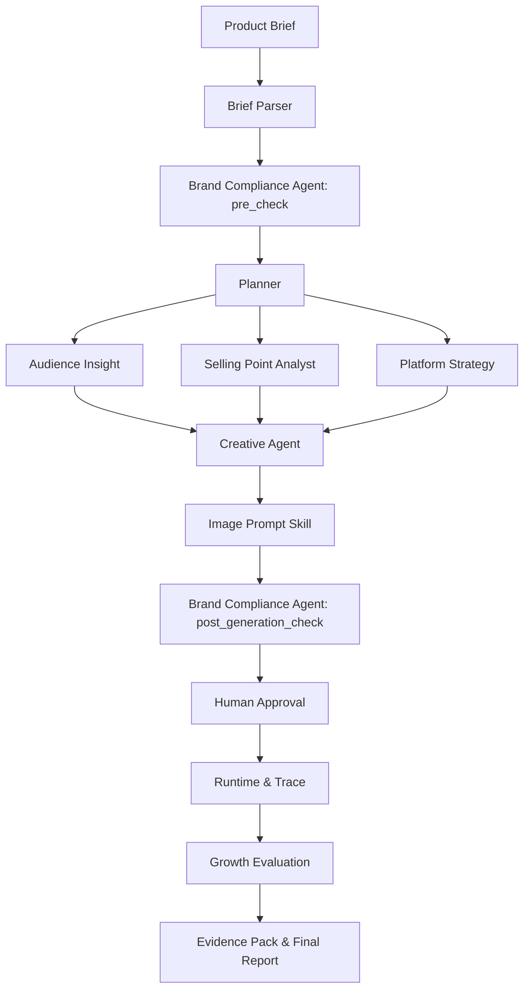

# E-commerce Growth Agent Studio

> An enterprise-oriented Agent workflow case study for AI-assisted content operations, runtime observability, evaluation, and governance.


This project translates a complex AI Agent system into an interactive demo, structured technical documentation, and an evidence-backed case study. It demonstrates how an e-commerce content request can move through task planning, parallel analysis, creative structuring, compliance checks, human approval, evaluation, and traceable reporting.

The default case uses a **sports camera product-launch workflow**. A second [Overseas Beauty Visual Content Case](outputs/cases/overseas_beauty_serum/README.md) translates US/UK audience and platform-content hypotheses into visual-effect specifications, executable image-prompt drafts, review gates, and an evaluation report. Both are reference implementations and portfolio demos, not production deployments.

## 1. Project Overview

E-commerce content operations often require teams to combine product briefs, audience insights, selling points, platform requirements, creative planning, visual direction, compliance review, approval, and post-run evaluation.

This project organizes those activities into a controlled Agent workflow with:

- structured inputs and outputs;
- explicit Agent and Skill responsibilities;
- parallel insight tasks;
- pre-generation and post-generation compliance checks;
- a human approval gate;
- deterministic validation;
- Runtime and Trace records;
- evidence-backed reporting.

### Local Demo Instructions

The interactive page is available after starting the local server described in [Quick Experience](#9-quick-experience).

## 2. Why It Matters

Without a shared workflow, important information can become fragmented across briefs, spreadsheets, content drafts, platform policies, and approval messages. This creates several risks:

- required brief fields may be missed before planning begins;
- unsupported product claims may enter creative content;
- platform and brand constraints may be checked too late;
- handoffs between analysis, creation, approval, and evaluation may be difficult to audit;
- teams may not be able to explain why an Agent produced a particular result.

The project addresses these issues by turning each stage into a structured, reviewable handoff. Every major conclusion can be linked to an artifact, field path, risk record, or validation result.

## 3. Target Users

The workflow is designed around several enterprise roles:

- **E-commerce operators**, who prepare campaign briefs and coordinate execution;
- **Brand and content teams**, who review positioning, creative structure, and platform adaptation;
- **Compliance or legal reviewers**, who inspect claims, evidence, authorization, and release conditions;
- **Product and Agent teams**, who design workflow rules, structured outputs, and evaluation criteria;
- **Managers**, who need a concise view of status, risks, approvals, and unresolved release gates.

These are design personas for the case study. They are not based on completed customer research or production usage data.

## 4. Agent Workflow



The same **Brand Compliance Agent** runs in two modes:

- `pre_check`: examines the brief, evidence, asset authorization, and input risks before planning;
- `post_generation_check`: examines generated structures, inherited risks, new risks, and blocked items before human review.

### Plain-language workflow explanation

- **Brief Parser** converts an unstructured product request into structured fields and identifies missing information.
- **Compliance Pre-check** checks whether claims, evidence, and source materials are suitable for downstream planning.
- **Planner** creates the execution plan and coordinates downstream tasks.
- **Insight Skills** analyze audience needs, selling points, and platform strategy in parallel.
- **Creative Agent** turns the upstream analysis into a controlled creative structure rather than immediately publishing final content.
- **Image Prompt Skill** defines visual structure, asset dependencies, and prohibited elements.
- **Compliance Post-check** reviews inherited and newly detected risks after the creative structure is produced.
- **Human Approval** prevents unreviewed content from entering final generation or release.
- **Runtime and Trace** record what actually ran and what evidence is available.
- **Growth Evaluation** classifies results, limitations, and unresolved issues.
- **Evidence Pack and Final Report** consolidate the artifacts into a reproducible project record.

## 5. How the System Works

### Structured handoffs

Each node has defined inputs, outputs, status fields, and downstream consumers. JSON Schema validation is used to verify structure and required governance states.

### Parallel execution

The Planner fans out three insight tasks:

- Audience Insight;
- Selling Point Analyst;
- Platform Strategy.

Their outputs are joined before the Creative Agent continues.

### Human-in-the-loop governance

The workflow contains a Human Approval Node, but real human sign-off has **not** been completed:

- `overall_decision = needs_revision`
- `human_signature = pending`
- `reviewer_name = null`
- `reviewed_at = null`

### Runtime and Trace types

The project distinguishes several kinds of execution evidence:

1. **Historical WorkTrace**
   Covers 15 historical artifact nodes. Runtime timestamps and a native `trace_id` were not available, so the missing values remain explicitly marked as unavailable.

2. **Deterministic Failure Scenario**
   Tests a missing `campaign_goal`, workflow blocking, repair, and retry. The recorded `58 ms` is local deterministic test time, not model, Agent, or full-workflow latency.

3. **Local Instrumented Runtime**
   Covers 10 business stages represented by 12 measured node records because the three Insight Skills run in parallel. It checks local artifacts and does not call a model or external API.

4. **Real Model Runtime**
   Records one real OpenAI model call for the Brief Parser node, including provider, model, Token usage, duration, stop reason, and output status.

5. **Real Agent Trace**
   Reconstructs a single-node trace from the real Brief Parser Runtime and its OpenClaw session record. The Runtime did not provide a native trace ID, so `trace_id = null`; a deterministic `artifact_trace_key` is used only for artifact linkage.

The real model record applies only to the **Brief Parser** node. It must not be presented as a complete production Runtime for the entire multi-Agent workflow.

## 6. Validation and Evidence

### Current validation snapshot

| Check | Result |
|---|---:|
| JSON parsing | 54 / 54 passed |
| Schema mappings | 18 / 18 passed |
| Portfolio evidence entries | 150 |
| Evidence source-file checks | 150 / 150 passed |
| Evidence JSON Pointer checks | 144 / 144 passed |
| Failure-scenario assertions | 7 / 7 passed |

The validation results prove structural consistency, schema compliance, artifact linkage, and selected governance rules. They do **not** prove customer value, content quality, or business growth.

### Evidence types

The evidence pack distinguishes:

- measured results;
- deterministic verification;
- artifact-derived evidence;
- mock-derived evidence;
- estimates;
- items requiring human review;
- unavailable data.

This prevents mock data, local test results, historical artifacts, and real model execution from being presented as equivalent forms of evidence.

### Risk status

- 10 inherited risks remain under review;
- 1 additional traceability risk was detected;
- blocked items are preserved rather than silently released.

## 7. Current Boundaries

### What is implemented

- multi-Agent workflow and responsibility decomposition;
- structured prompts, inputs, outputs, and handoff contracts;
- two-stage compliance design;
- Human Approval Node and structured approval record;
- growth evaluation and evidence aggregation;
- JSON and Schema validation;
- Historical and Failure WorkTrace;
- local instrumented Runtime;
- one real Brief Parser model Runtime and single-node Agent Trace;
- interactive portfolio page and local playback.

### What is not implemented or validated

- completed real-human approval or reviewer signature;
- a production multi-Agent Runtime with live model calls at every node;
- native full-workflow `trace_id`, per-node production timestamps, or complete telemetry;
- enterprise accounts, roles, permissions, database, or cloud artifact storage;
- production publishing infrastructure;
- real customer testing;
- verified CTR, CVR, GMV, content-quality, or efficiency improvements;
- production-ready or customer-validated status.

Current boundary flags:

- `validation_status = pass`
- `governance_status = needs_review`
- `overall_decision = needs_revision`
- `production_ready = false`
- `customer_validated = false`

### Release gates

The following release gates remain blocked:

- `final_marketing_copy = blocked`
- `final_image_prompt = blocked`
- `image_generation = blocked`
- `frontend_page = blocked`
- `public_release = blocked`

These gates are blocked because evidence, authorization, or human sign-off is incomplete. This is separate from structural validation, which has passed.

## 8. Next Steps

- generate and human-review neutral concept frames for the overseas beauty case;
- collect real feedback from target operators and reviewers;
- run more real Agent nodes with measured Runtime data;
- capture native trace IDs and per-node timestamps where supported;
- add real reviewer identity, decision, and approval time;
- validate content quality and revision rates with human review;
- test the workflow with real customers before making business-impact claims;
- design enterprise account, permission, storage, and publishing capabilities only after the workflow is validated.

## 9. Quick Experience

### Start the local portfolio page

From the project root:

```bash
python3 -m http.server 4173 --bind 127.0.0.1
```

Then open:

```text
http://127.0.0.1:4173/portfolio/
```

The portfolio playback uses existing artifacts and does not call a live model.

### Run deterministic validation

```bash
npm install
node scripts/validate_artifacts.mjs
```

### Important local-demo notes

- The `127.0.0.1` URL works only on the local machine running the server.
- The portfolio page does not require an API key.
- The automated workflow playback is not a live Agent execution.
- Real model and Trace evidence already stored in the repository represents the recorded Brief Parser run only.

## 10. Repository Guide

```text
portfolio/   Interactive case-study page
data/        Sample input data
prompts/     Agent and Skill prompts
workflow/    Workflow definitions and I/O contracts
schemas/     JSON Schemas
scripts/     Runtime, trace, build, and validation scripts
outputs/     Generated artifacts, reports, Runtime, Trace, and evidence packs
docs/        Specifications, runbooks, diagrams, and supporting documentation
```

## 11. Further Reading

- [Case Study](docs/case_study.md)
- [Enterprise Governance Design](docs/enterprise_governance_design.md)
