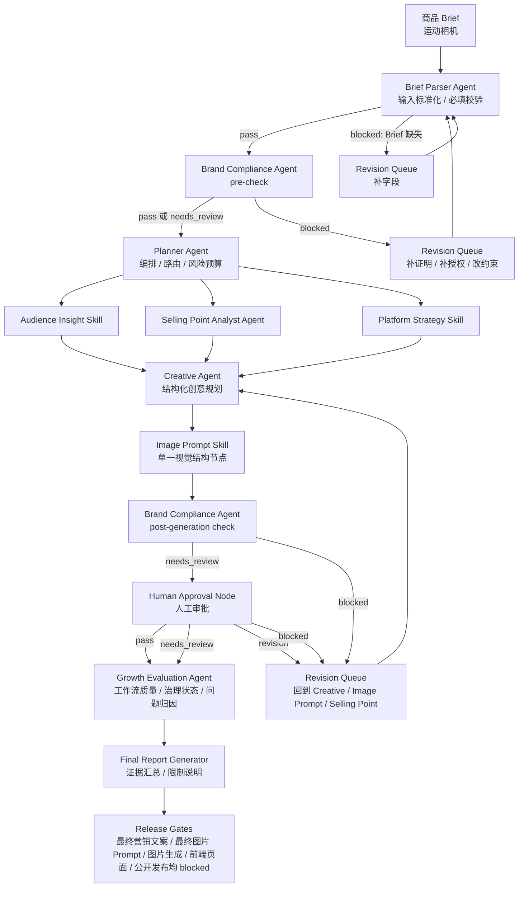

# 电商增长 Agent 工作台 Case Study

> 本 Case Study 基于仓库内现有产物撰写，用于作品集页面展示 AI Agent 产品、Workflow 编排、治理、可观测性与评估设计。它不假设存在真实客户，不声称生产上线，也不生成最终营销文案、最终图片 Prompt、图片、电商前端页面或公开发布素材。

## 1. Business Background

电商运营团队从商品 Brief 到活动执行，通常要让商品运营、内容运营、品牌/合规、设计、渠道运营和复盘评估等角色连续协作。以本项目唯一完整案例“运动相机”为例，团队需要把不完全一致的商品 Brief 转成可审阅的结构化规划包：先校验输入字段，再梳理用户洞察、卖点、平台策略、创意结构、视觉素材需求、合规风险、人工审批状态和评估口径，最后汇总成报告。

原始协作问题不在于“缺少一段文案”，而在于信息分散和传递链路不稳定：商品资料、用户场景、声明来源、素材授权、平台内容结构、审批结论和评估指标分散在不同角色与文件中；人工传递时容易丢失字段、风险 ID、声明 ID、来源文件或审批状态；审核滞后时，下游可能已经基于未证明的声明或未授权素材继续规划；结果难追踪时，也难判断失败发生在输入、编排、生成、合规、审批还是评估节点。项目 README 将其定位为 ToB 多 Agent 工作流 Demo，目标是把商品 Brief 转成“可编排、可审批、可追踪、可评估”的结构化创意规划包（证据：`README.md`）。Portfolio Evidence Pack 也把项目定位为面向 artifact traceability、governance 和 workflow evidence 的作品集产物，而不是客户业务结果（证据：`outputs/portfolio_evidence_pack.json`）。

因此，本项目把“运动相机”作为单一 Demo 商品，用 Agent Workflow 解决协作、交接、治理和观测问题：输入要标准化，Planner 负责编排，多 Agent/Skill 按职责产生中间产物，Brand Compliance 在前后两个关键时点拦截风险，Human Approval 在发布前保留正式人工判断，Growth Evaluation 只做评估与问题归因，Final Report 只汇总证据与限制（证据：`workflow/agent_workflow.md`、`docs/workflow_diagram.md`、`PROJECT_MEMORY_FOR_OPENCLAW.md`）。

## 2. Problem

本项目明确处理五类问题。每一类问题都可能造成返工、违规发布或评测失真；但仓库没有真实返工时间、成本、转化或客户效果数据，因此本文不编造这些结果。

1. **Brief 缺失**：商品 Brief 的必填字段可能缺失。如果输入闸口不阻断，Planner 与下游节点会基于不完整目标继续规划，造成后续返工或错误路由。Failure Scenario Test 在内存中删除 `campaign_goal` 后，首次验证被阻断，修复后再通过（证据：`outputs/failure_scenario_test_report.json`、`outputs/worktrace_failure_scenario.json`）。
2. **声明缺证据**：商品能力、使用条件、效果表达或增长目标如果没有正式证明，不能作为公共面向用户的事实承诺。否则可能导致夸大宣传、合规风险或评估口径失真。README 和合规链路要求缺少来源或证明的参数标记为 `needs_review` 或 `blocked`（证据：`README.md`、`outputs/worktrace.json`）。
3. **素材授权不清**：商品图、App 截图、Logo、人物肖像和场景素材需要授权审查。授权状态不清会让视觉规划误进入最终生成或发布流程，带来侵权和品牌治理风险（证据：`outputs/portfolio_evidence_pack.json`、`outputs/worktrace.json`）。
4. **节点信息丢失**：多节点交接中，risk_id、claim_id、source file 和 approval state 可能被下游遗漏。WorkTrace 通过节点输入输出、risk_ids、claim_ids 和 Human Approval 状态做 retrospective artifact reconstruction，但历史节点没有真实 runtime telemetry（证据：`outputs/worktrace.json`）。
5. **输出难审计**：如果结构化规划输出被误当作最终已批准营销内容，团队会把 Schema pass 或 JSON pass 误读成业务通过。项目通过 blocked release gates、Human Approval 和 Final Report 边界明确：结构验证通过不等于事实、授权、审批或发布许可通过（证据：`outputs/artifact_validation_report.json`、`outputs/portfolio_evidence_pack.json`、`README.md`）。

这些问题会让团队在后续节点中反复补字段、补证据、补授权、重做合规检查，也可能让未获证明的声明或未授权素材进入公开表达；同时，如果评测数据来源混淆，把 mock、estimated、not_available 或 deterministic validation 包装成真实结果，也会导致评测失真（证据：`PROJECT_MEMORY_FOR_OPENCLAW.md`、`outputs/portfolio_evidence_pack.json`）。

## 3. Architecture Decisions

### 3.1 Planner 只负责编排

**选择**：Planner Agent 只负责任务拆解、节点路由、风险预算、回退路径和交接结构，不直接生成创意内容。

**理由**：编排质量和创意质量需要可分离评估。Planner 如果同时生成创意，一旦输出失败，难以判断是输入缺失、路由错误、风险预算不足，还是创意节点能力问题。让 Planner 只编排，可以把 Brief Parser、Audience Insight、Selling Point Analyst、Platform Strategy、Creative Agent、Image Prompt Skill、Brand Compliance、Human Approval、Growth Evaluation 和 Final Report 的输入输出边界保持清楚（证据：`README.md`、`workflow/agent_workflow.md`、`outputs/worktrace.json`）。

**代价**：增加了节点交接成本，需要 I/O 合约、Schema、WorkTrace 和 release gates 来控制复杂度。项目用结构化 JSON、Schema 验证和 WorkTrace 来补偿这个代价（证据：`outputs/artifact_validation_report.json`、`outputs/worktrace.json`）。

### 3.2 采用多个职责单一的 Agent/Skill

**选择**：把用户洞察、卖点分析、平台策略、创意结构、视觉结构、合规、审批、评估和报告拆成多个职责单一的 Agent/Skill。

**理由**：电商运营协作本身跨多个专业角色。职责单一的 Agent/Skill 更容易复用、替换和定位失败：Audience Insight 处理人群，Selling Point Analyst 处理卖点与证明需求，Platform Strategy 处理渠道与漏斗，Creative Agent 只输出创意结构，Image Prompt Skill 只输出视觉结构和素材依赖，Growth Evaluation 只做评估与问题归因（证据：`workflow/agent_workflow.md`、`docs/workflow_diagram.md`）。

**代价**：多节点会带来字段交接、状态继承和一致性维护成本。项目通过 risk_id、claim_id、source refs、approval state 和 WorkTrace 记录降低信息丢失风险（证据：`outputs/worktrace.json`、`outputs/portfolio_evidence_pack.json`）。

### 3.3 Brand Compliance 分为 pre-check 和 post-generation check

**选择**：使用同一个 Brand Compliance Agent 的两次调用：Brief Parser 之后、Planner 之前做 pre-check；Image Prompt Skill 之后、Human Approval 之前做 post-generation check。

**理由**：pre-check 把缺证据声明、素材授权、禁用表达和高风险字段提前暴露，避免无效或高风险规划进入下游；post-generation check 则检查结构化创意和视觉规划中继承的风险、新增声明和可追溯性缺口。两次调用共用同一治理能力和稳定词汇，避免把它误拆成两个规则漂移的 Compliance Agent（证据：`README.md`、`workflow/agent_workflow.md`、`docs/workflow_diagram.md`、`outputs/portfolio_evidence_pack.json`）。

**代价**：增加了一次合规检查成本，也要求明确历史与目标设计边界。项目说明双阶段合规属于 `retrospective_design_validation` 和后续正式目标工作流，不改写 Steps 1-15 的历史执行事实（证据：`PROJECT_MEMORY_FOR_OPENCLAW.md`、`workflow/agent_workflow.md`）。

### 3.4 Human Approval 位于生成结果和发布之间

**选择**：Human Approval Node 位于 post-generation check 之后、最终生成/发布之前。

**理由**：确定性校验、Schema pass 和 Agent 输出不能替代品牌、法务、运营、内容与设计负责人对事实证明、授权边界、品牌责任和发布准备度的判断。Human Approval 把人工判断变成工作流内的正式状态，而不是流程外口头确认。历史 WorkTrace 中 Human Approval 状态为 `needs_revision`，说明它没有被包装成最终批准（证据：`outputs/worktrace.json`、`outputs/portfolio_evidence_pack.json`、`PROJECT_MEMORY_FOR_OPENCLAW.md`）。

**代价**：人工审批降低“一键自动化”速度，但这是企业发布责任所需的治理成本。项目保留 revision queue 和 blocked gates，避免结构化规划绕过人审直接发布（证据：`README.md`、`outputs/worktrace.json`）。

### 3.5 只保留一个 Image Prompt Skill

**选择**：当前只保留单一 Image Prompt Skill，不拆成多个视觉节点。

**理由**：本阶段 Image Prompt Skill 的职责是定义视觉素材结构、素材依赖、禁止元素和受控生成前置条件，不生成最终图片 Prompt 或图片。当前范围不足以证明拆成视觉策略、Prompt 编译和图片生成执行会带来独立权限、独立模型、独立评测或明显并行收益（证据：`README.md`、`workflow/agent_workflow.md`、`docs/workflow_diagram.md`）。

**代价**：单节点职责相对宽，需要用结构化输出和 release gates 限制边界。最终图片 Prompt、图片生成和公开发布继续 blocked（证据：`README.md`、`outputs/worktrace.json`）。

### 3.6 没有采用单一 LLM

**选择**：没有让一个 LLM 一次性完成 Brief 解析、分析、创意、合规、审批模拟、评估和报告。

**理由**：单一 LLM 响应会隐藏责任边界，难以定位失败，也难以让每个节点拥有独立输入、输出、状态、证据来源和评估口径。对企业工作流而言，错误定位、审计和审批比“链路短”更重要（证据：`README.md`、`outputs/worktrace.json`、`outputs/artifact_validation_report.json`）。

**代价**：拆分节点后需要维护合约、验证脚本、WorkTrace 和报告边界；否则多 Agent 也会变成多个不透明文本块。项目用 Schema、Portfolio Evidence Pack、WorkTrace 和 Failure Scenario Test 做约束（证据：`outputs/portfolio_evidence_pack.json`、`outputs/worktrace_failure_scenario.json`）。

### 3.7 没有采用 Multi-Agent Debate

**选择**：没有采用 Multi-Agent Debate 作为核心架构。

**理由**：本项目要证明的是企业电商工作流的可编排、可交接、可审批、可追踪和可评估，而不是让多个模型互相辩论得出更“像答案”的结论。Debate 可能提高某些开放问题的探索性，但不天然提供 Brief 必填校验、risk_id/claim_id 继承、素材授权状态、release gates、Human Approval 或结构化审计记录。

**代价**：项目没有展示多模型观点对抗能力；换来的是更稳定的职责边界、确定性验证和治理链路。对这个作品集目标而言，这是有意取舍，而不是默认认为 Agent 数量越多越好（证据：`docs/case_study_enrichment_spec.md`、`README.md`）。

## 4. Workflow

主流程从商品 Brief 开始，到 Final Report 结束。核心原则是：先标准化输入，再做前置合规和 Planner 编排；分析节点可并行；Creative Agent 和单一 Image Prompt Skill 只产出结构化规划；post-generation check 与 Human Approval 决定是否进入修订；Growth Evaluation 评估工作流质量和治理状态；Final Report 汇总证据，不代表发布。

流程覆盖如下：

- **输入标准化**：Brief Parser Agent 校验商品 Brief 与 Schema，缺少必填字段时进入 blocked 和 Revision Queue（证据：`workflow/agent_workflow.md`、`outputs/worktrace_failure_scenario.json`）。
- **Planner 编排**：Planner Agent 负责任务拆解、路由、风险预算与回退结构，不直接生成创意（证据：`README.md`、`outputs/worktrace.json`）。
- **多 Agent/Skill 执行**：Audience Insight、Selling Point Analyst、Platform Strategy 支持并行分析；Creative Agent 输出内容结构；Image Prompt Skill 保持单一节点并只输出视觉结构（证据：`workflow/agent_workflow.md`、`docs/workflow_diagram.md`）。
- **两阶段合规**：pre-check 控制输入风险，post-generation check 检查结构化创意与视觉规划中的继承风险和新增风险；两次都是同一个 Brand Compliance Agent（证据：`PROJECT_MEMORY_FOR_OPENCLAW.md`、`outputs/portfolio_evidence_pack.json`）。
- **Human Approval**：生成结果与发布之间保留正式人工审批，历史状态仍为 `needs_revision`（证据：`outputs/worktrace.json`）。
- **Growth Evaluation**：评估工作流质量、数据来源、治理状态与问题归因，不把测评包装成业务增长结果（证据：`outputs/portfolio_evidence_pack.json`）。
- **Final Report**：只做结构化汇总和边界说明，不触发 release（证据：`README.md`、`workflow/agent_workflow.md`）。

五个 release gates 继续 blocked：最终营销文案、最终图片 Prompt、图片生成、前端页面、公开发布（证据：`README.md`、`outputs/worktrace.json`、`outputs/worktrace_failure_scenario.json`）。

## 5. Failure Scenario

Failure Scenario 是一个确定性结构测试，不是 LLM 推理耗时，也不是完整 Agent 工作流运行耗时。

测试过程严格依据现有产物：

1. 从正常 Brief 的内存副本删除必填字段 `campaign_goal`（证据：`outputs/failure_scenario_test_report.json`）。
2. 首次 Product Brief Schema 验证失败，工作流状态变为 `blocked`，Planner 未执行（证据：`outputs/failure_scenario_test_report.json`、`outputs/worktrace_failure_scenario.json`）。
3. Revision Queue 创建修复项，从原始 source brief 恢复 `campaign_goal`，且 source file 未被修改（证据：`outputs/failure_scenario_test_report.json`）。
4. retry 1 次（证据：`outputs/worktrace_failure_scenario.json`），使用同一个 Schema 重新验证。
5. 再次验证 `pass`，下一道检查为 `brand_compliance_pre_check`（证据：`outputs/failure_scenario_test_report.json`）。

Failure Scenario WorkTrace 记录了 3 个节点（证据：`outputs/worktrace_failure_scenario.json`）：Initial Validation、Revision Queue、Schema Rerun。路径为 `blocked -> revision -> pass`。实测总耗时为 58 ms（证据：`outputs/worktrace_failure_scenario.json`、`outputs/failure_scenario_test_report.json`），该数字只属于 Failure Scenario Test 脚本总耗时，不是 Planner runtime，也不是完整 Agent workflow runtime。retry_count 为 1（证据：`outputs/worktrace_failure_scenario.json`），只属于该确定性失败场景。

该测试证明输入闸口和修复路径符合结构约束；它不证明商品声明真实、素材授权完成、合规风险解决、客户效果成立或生产可用（证据：`outputs/failure_scenario_test_report.json`、`outputs/worktrace_failure_scenario.json`）。

## 6. Evidence and Results

本节只使用仓库内现有结果，并按 evidence type 明确区分，不把结构验证包装为业务增长结果。

### measured

- Portfolio Evidence 总数为 122（证据：`outputs/portfolio_evidence_pack.json`）。它证明 evidence pack 中汇总的证据项数量与来源可追踪，不证明客户业务效果。
- Failure Scenario Test 实测总耗时为 58 ms（证据：`outputs/worktrace_failure_scenario.json`、`outputs/failure_scenario_test_report.json`）。它只属于确定性失败场景脚本。

### deterministic_verified

- JSON 解析结果为 45/45（证据：`outputs/artifact_validation_report.json`）。它证明当前检查范围内 JSON 可解析，不证明事实真实性。
- Schema 映射验证结果为 15/15（证据：`outputs/artifact_validation_report.json`）。它证明映射 artifact 的结构与关键约束通过，不证明合规、人审或发布许可通过。
- Failure Scenario retry_count 为 1（证据：`outputs/worktrace_failure_scenario.json`），且路径为 `blocked -> revision -> pass`（证据：`outputs/worktrace_failure_scenario.json`）。

### artifact_derived

- Historical WorkTrace 覆盖 15 个节点（证据：`outputs/worktrace.json`）。这是 retrospective artifact reconstruction，不是真实 runtime telemetry。
- Failure Scenario WorkTrace 覆盖 3 个节点（证据：`outputs/worktrace_failure_scenario.json`）。这是确定性测试链路，不是新增 Agent。
- Historical WorkTrace 的 `trace_id = null`（证据：`outputs/worktrace.json`）。
- Failure Scenario WorkTrace 的 `trace_id = null`（证据：`outputs/worktrace_failure_scenario.json`）。
- `production_ready = false`（证据：`outputs/portfolio_evidence_pack.json`、`outputs/worktrace.json`、`outputs/worktrace_failure_scenario.json`）。
- `customer_validated = false`（证据：`outputs/portfolio_evidence_pack.json`、`outputs/worktrace.json`、`outputs/worktrace_failure_scenario.json`）。

### historical_not_available

- Historical WorkTrace 的历史节点没有真实 timestamp、started_at、completed_at 或 duration_ms；15 个历史节点的时间状态为 historical_not_available（证据：`outputs/worktrace.json`）。
- historical trace_id 不可用，因此保持 `null`，不能补造 request_id、trace_id 或节点 runtime（证据：`outputs/worktrace.json`）。

结论：现有结果证明了结构化产物、Schema 约束、证据索引、WorkTrace 重建和确定性失败恢复路径；没有证明真实客户投放、CTR、CVR、GMV、转化提升或生产就绪（证据：`README.md`、`outputs/portfolio_evidence_pack.json`、`PROJECT_MEMORY_FOR_OPENCLAW.md`）。

## 7. Limitations

- 当前只有“运动相机”一个完整案例（证据：`outputs/portfolio_evidence_pack.json`、`PROJECT_MEMORY_FOR_OPENCLAW.md`）。它不能外推到跨品类稳定性。
- 历史节点没有真实 timestamp 和 runtime；历史 WorkTrace 是 retrospective artifact reconstruction，不是生产 telemetry（证据：`outputs/worktrace.json`）。
- 没有真实客户验证；`customer_validated = false`（证据：`outputs/portfolio_evidence_pack.json`）。
- 没有生产就绪证明；`production_ready = false`（证据：`outputs/portfolio_evidence_pack.json`）。
- 没有真实 CTR、CVR、GMV 或转化提升数据；相关指标只能作为观测、复盘或未来评估字段，不能写成已实现结果（证据：`README.md`、`outputs/portfolio_evidence_pack.json`）。
- 五个 release gates 继续 blocked：最终营销文案、最终图片 Prompt、图片生成、前端页面、公开发布（证据：`README.md`、`outputs/worktrace.json`、`outputs/worktrace_failure_scenario.json`）。
- Human Approval 的历史状态仍为 `needs_revision`，不能改写为最终批准（证据：`outputs/worktrace.json`）。
- 双阶段合规验证中的 `validation_status = pass` 不等于 governance pass；合规和授权仍需人工审核（证据：`outputs/portfolio_evidence_pack.json`、`PROJECT_MEMORY_FOR_OPENCLAW.md`）。
- 下一阶段应优先做跨品类样本、真实运行日志、字段级人工审阅、素材授权和真实审批记录验证，而不是继续增加 Agent。继续增加 Agent 不能替代数据质量、审计证据和客户验证（证据：`workflow/agent_workflow.md`、`PROJECT_MEMORY_FOR_OPENCLAW.md`）。

## 本人完成内容

本人在该作品集项目中的完成范围限定为：需求拆解、Agent/Skill 职责设计、提示词设计、I/O 合约设计、合规机制设计、Schema 约束、验证脚本、WorkTrace 结构、Failure Scenario 失败测试和作品集页面组织。本人没有声称独立编写所有底层框架、模型、浏览器运行环境、验证依赖或基础平台能力；项目展示的是在现有工具与模型能力之上，对电商 Agent Workflow 的产品化拆解、治理边界和证据化呈现。
