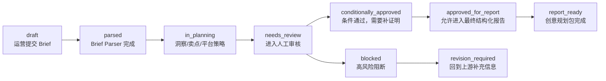

# ToB 治理功能设计

项目名称：E-commerce Growth Agent Studio / 电商增长 Agent 工作台

这个文件用于补齐作品集里的 ToB 功能。它说明本项目不是个人 AI 文案工具，而是面向企业团队的 Agent 工作台，需要权限、审批、日志、知识库和可解释执行记录。

## 1. 企业角色设计

| 角色 | 主要职责 | 可执行操作 |
| --- | --- | --- |
| Operator / 运营 | 提交商品 Brief，查看工作流结果 | 创建 Brief、运行节点、查看报告、提交审核 |
| Marketing Lead / 增长负责人 | 判断策略是否符合活动目标 | 审核平台策略、调整指标、批准进入内容规划 |
| Brand Reviewer / 品牌审核 | 检查品牌语气、Logo、素材授权和禁用表达 | 标记风险、要求补证、阻断输出 |
| Legal Reviewer / 合规审核 | 检查广告法、功效宣称、绝对化表达 | 批准、条件批准、阻断 |
| Admin / 管理员 | 配置团队权限、知识库和工作流模板 | 管理角色、配置规则、查看日志 |

## 2. 审批状态机



当前 MVP 的状态是：

```text
report_ready for structured planning
blocked for final marketing copy / final image prompt / image generation / public publishing
```

当前已补充一份 mock 企业审计日志：

[audit_log_sample.json](/Users/mabook/Documents/Codex/2026-06-24/wo-x/ecommerce-growth-agent-studio/data/audit_log_sample.json)

## 3. 审计日志字段

企业 Agent 产品需要知道“谁在什么时候让哪个 Agent 做了什么”。建议每次节点运行都写入下面的日志字段：

| 字段 | 示例 | 作用 |
| --- | --- | --- |
| event_id | audit_20260625_001 | 唯一日志编号 |
| timestamp | 2026-06-25 16:20:00 | 记录时间 |
| actor_role | Operator | 操作角色 |
| agent_or_skill | Brand Compliance Agent | 当前节点 |
| input_artifacts | outputs/image_prompt_pack_outline.json | 使用了哪些上游文件 |
| output_artifacts | outputs/brand_compliance_report.json | 产出了哪些文件 |
| decision | blocked | 节点结论 |
| risk_tags | claim_proof_missing, asset_license_missing | 风险标签 |
| next_gate | human_review_required | 下一个闸口 |

## 4. 知识库配置

为了让 Agent 更适合企业使用，后续可以把规则配置成知识库，而不是每次都写在 prompt 里。

| 知识库 | 内容 | 供哪个节点使用 |
| --- | --- | --- |
| Brand Guideline KB | 品牌语气、禁用词、Logo 使用规范 | Creative Copy Agent、Image Prompt Skill、Brand Compliance Agent |
| Product Evidence KB | 参数证明、检测报告、素材授权 | Selling Point Analyst Agent、Brand Compliance Agent |
| Platform Rule KB | 抖音、小红书、天猫、京东、直播间规则 | Platform Strategy Skill、Brand Compliance Agent |
| Historical Campaign KB | 历史活动素材、指标、复盘结论 | Growth Metrics Agent、Creative Package Reporter |

当前 MVP 还没有真实知识库接入，但已经通过 `data/sample_brief.json`、`outputs/*.json` 和合规报告模拟了知识流转。

## 5. 可解释执行记录

最终报告中每个关键结论都应该能回答四个问题：

| 问题 | 当前项目对应位置 |
| --- | --- |
| 这个结论来自哪里？ | Artifact Index、Workflow Trace、各节点 JSON |
| 是哪个 Agent 生成的？ | prompts 目录和 outputs 目录一一对应 |
| 是否有风险？ | Brand Compliance Agent 和 Growth Metrics Agent |
| 是否允许继续生成？ | final_creative_package_report 的 blocked 结论 |

这就是本项目最适合强调的 ToB 亮点：不是“AI 写得快”，而是“AI 工作过程可追踪、可审核、可解释”。

## 6. 两周 Demo 里最建议展示的 ToB 功能

按投入产出比排序：

1. **人工审批流**：已经有 Brand Compliance Agent 和 blocked gate，最容易讲清楚。
2. **可解释执行记录**：已经有每个节点的 JSON / Markdown 产物和最终报告。
3. **审计日志样例**：已补 `data/audit_log_sample.json`。
4. **知识库配置页**：可以作为下一阶段前端页面，不必在当前 MVP 强做。
5. **权限管理**：可以先作为设计说明，工程实现放到后续。

当前建议：作品集里把“人工审批 + 可解释执行记录 + 审计日志字段”作为 ToB 功能主线。
