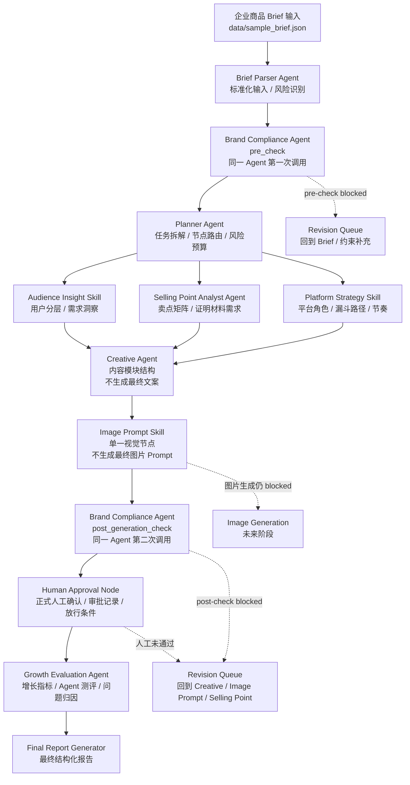

# 工作流图

项目名称：E-commerce Growth Agent Studio / 电商增长 Agent 工作台

这张图用于作品集展示：它说明企业商品 Brief 如何经过多个 Agent / Skill，变成可审计、可审批、可评估的结构化创意规划包。注意，本项目不直接生成最终营销文案、最终图片 Prompt、图片或公开发布素材。

## 1. V2 总览图

## 2. 分层理解

| 层级 | 对应节点 | 作用 |
| --- | --- | --- |
| 输入层 | 商品 Brief、Schema、Workflow 契约 | 把企业需求变成可处理的标准输入。 |
| 规划层 | Planner Agent | 拆解任务、选择节点、设定顺序、标记风险与评估目标。 |
| 分析层 | Audience Insight、Selling Point Analyst、Platform Strategy | 把用户、卖点和平台策略结构化，可并行执行。 |
| 创意层 | Creative Agent、Image Prompt Skill | 生成内容结构和视觉素材结构，但不直接生成最终素材。 |
| 治理层 | Brand Compliance（pre_check / post_generation_check）、Human Approval Node | 同一个 Brand Compliance Agent 两次调用，建立合规闸口、人工审批和企业可审计记录。 |
| 测评层 | Growth Evaluation Agent | 同时评估增长指标和 Agent 过程质量。 |
| 报告层 | Final Report Generator | 汇总完整 Agent Workflow，形成作品集可展示产物。 |

## 3. 当前状态

| 项目 | 状态 |
| --- | --- |
| V1 结构化工作流 | 已跑通 |
| V1 Agent / Skill 节点 | 已完成 11 步产物 |
| 正式目标工作流图 | 已更新为 Brief Parser → Brand Compliance（pre_check）→ Planner → 三个分析节点 → Creative → 单一 Image Prompt Skill → Brand Compliance（post_generation_check）→ Human Approval → Growth Evaluation → Final Report |
| Step 12 Planner Agent | 已完成、修订并验收 |
| Step 13 Human Approval Node | 已完成，状态 `needs_revision`；测评可继续，生成与发布未放行 |
| Step 14 Growth Evaluation Agent | 已完成，状态 `needs_review` |
| Step 15 V2 Final Report Generator | V2 Final Report Generator 已完成，状态 `needs_review` |
| 项目总体状态 | Steps 1-15 已完成；`needs_review`；两周作品集 Demo 已完整交付，但不代表生产系统上线 |
| 后续方向 | 后续只做验证扩展，不再增加必做 Agent 节点；最终生成和公开发布继续 `blocked` |
| 单一 Brand Compliance Agent | 已保留；两次 Compliance 是同一个 Agent 的两次调用，不是两个 Compliance Agent |
| 单一 Image Prompt Skill | 已保留，不拆分 |
| 历史与目标设计 | Steps 1-15 是已完成历史产物；双阶段合规是 `retrospective_design_validation` 和后续目标设计，`historical_execution_claimed = false` |
| 双阶段验证 | JSON 解析 37/37；Schema 映射 11/11；`validation_status = pass`；`governance_status = needs_review`；inherited risks 10；resolved 0；unresolved 10；newly detected 1（`risk_traceability_gap`，治理发现而非结构验证失败） |
| 最终营销文案 | blocked |
| 最终图片 Prompt | blocked |
| 图片生成 | blocked |
| 公开发布 | blocked |
| 真实客户验证 | 无 |
| 生产运行数据 | 无 |

边界保持不变：最终营销文案 blocked；最终图片 Prompt blocked；图片生成 blocked；前端页面 blocked；公开发布 blocked。没有真实客户验证，没有生产运行数据；商品名称只使用“运动相机”；不新增或恢复不受支持的参数表述。

## 4. 为什么更符合目标岗位

- 它不是单次生成内容，而是把企业营销链路拆成多个可复用 Agent / Skill。
- Planner 体现 Agent 编排和任务拆解能力。
- Human Approval 体现 ToB 产品必须具备的人工确认、权限和治理意识。
- Growth Evaluation 让项目从“电商工作流”升级为“带测评体系的 Agent 工作流”。
- 单一 Image Prompt Skill 保持项目范围可控，不把两周 Demo 拆得过散。
- 最终报告展示的是可治理的创意规划包，而不是未经审核的投放素材。
