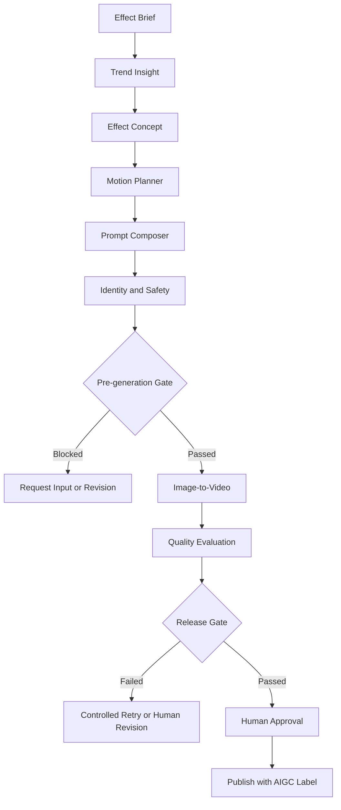

# Parallel Self — AIGC Effect Operations Studio

> A product operations case that turns overseas platform trends and user-expression needs into an executable AIGC effect concept, prompt system, multi-agent workflow, evaluation framework, and release process.

[Live Demo](https://ecommerce-growth-agent-studio.vercel.app/effects/) · [GitHub Repository](https://github.com/luyanpeng225-glitch/Ecommerce-Growth-Agent-Studio)

| Current status | Result |
|---|---:|
| Workflow artifacts | 4 / 4 complete |
| Real model calls | 0 |
| Generated videos | 0 |
| Release gate | Awaiting compliant input |

> This is a product and operations prototype, not a commercial AIGC service. The workflow correctly stopped before the model call because no authorized test portrait was provided.

## 1. Overview

**Parallel Self** is an in-product AIGC effect case for a consumer creative application. It is not a marketing-asset generator.

A user uploads one authorized adult portrait, selects a visual route, and generates a seven-second alternate-world micro-story. The subject's identity remains stable while the environment transforms through a continuous lighting and camera transition. The ending returns to a composition close to the opening frame, creating a natural loop.

The goal is not to showcase one lucky generation. It is to design an operational system that connects:

- overseas trend and user-opportunity discovery;
- AIGC effect definition;
- prompt, parameter, and failure-policy management;
- multi-agent orchestration;
- identity protection and safety review;
- quality evaluation and human revision;
- traceable execution and release decisions.

### User job

> Turn one authorized portrait into a shareable alternate-world micro-story without video-editing or prompt-engineering expertise.

### Product hypothesis

Users do not need another static style filter. They need a creative experience that is low effort, identity-preserving, built around a clear reveal, and designed for comparison and sharing on short-form video platforms.

## 2. My Role

For this case, I was responsible for:

- defining the target user, use case, and product value proposition;
- translating overseas content trends into an AIGC effect concept;
- designing the front-stage user journey and back-stage multi-agent workflow;
- specifying prompt structure, model controls, and failure-recovery policies;
- defining product metrics, model-quality thresholds, and safety guardrails;
- designing human-in-the-loop review and publishing gates;
- structuring the operations workspace, run states, and trace model;
- separating product hypotheses, demo data, and actual execution evidence.

## 3. Product Strategy

### Product definition

| Dimension | Definition |
|---|---|
| Target markets | United States and United Kingdom |
| Target platforms | TikTok, Instagram Reels, and YouTube Shorts |
| Product surface | Built-in effect in a consumer creative app |
| Input | One authorized adult portrait |
| Output | 7 seconds, 9:16, 1080 × 1920, loopable |
| Review mode | Strict |

### Creative routes

| Route | User signal | Visual direction | Primary risk |
|---|---|---|---|
| Cinematic | Story-led self-expression | Independent-film street at blue hour | Excessive camera motion |
| Dreamlike | Gentle surreal escapism | Miniature cloud garden with floating particles | Identity drift from stylization |
| Retro Memory | Nostalgia and personal memory | Sun-faded summer street with natural light leaks | Unlicensed brand or period references |

### Key product decisions

**Seven seconds instead of a longer video.** A short format limits generation cost and unstable frames while supporting a fast reveal and loop-friendly playback.

**Three curated routes instead of an open prompt box.** A constrained choice reduces decision friction, improves output consistency, and gives the operations team maintainable templates that can be tested route by route.

**Identity strength over stylization.** In portrait-based AIGC, recognizability is more important than visual intensity. The default identity strength is `0.90`, compared with a stylization value of `0.40`.

**One automated retry at most.** Unlimited retries increase inference cost and can hide model limitations. One controlled retry is allowed; unresolved failures move to human revision.

## 4. Experience and Agent Workflow

The front-stage journey minimizes user effort. The back-stage agent workflow turns ideation, generation, review, and evaluation into structured operations.

### User journey


### Multi-agent workflow



### Responsibility domains

| Domain | Agent | Primary output |
|---|---|---|
| Opportunity | Trend Insight | User needs, platform signals, opportunities, and risks |
| Experience | Effect Concept | Hook, journey, narrative, and creative routes |
| Generation | Motion Planner + Prompt Composer | Timeline, prompts, controls, and fallbacks |
| Governance | Identity + Safety | Input validation, identity rules, and risk decisions |
| Evaluation | Quality Evaluation + Human Review | Quality scores, revisions, and release decisions |

## 5. Prompt and Model Operations

The prompt is managed as a testable, reusable, and versioned product asset rather than a one-off instruction.

The operating package includes:

- a base prompt template;
- route-specific world variables;
- identity, subject-motion, and camera constraints;
- a negative prompt;
- parameter and seed management;
- failure classification;
- one controlled retry;
- a human revision path.

### Default controls

| Control | Default |
|---|---:|
| Identity strength | 0.90 |
| Motion strength | 0.35 |
| Stylization | 0.40 |
| Camera speed | Slow |
| Seed | Locked |
| Controlled retry | Maximum one |

### Failure handling

| Failure | Response |
|---|---|
| Multiple faces | Block and request a single-person portrait |
| Identity similarity below 0.82 | Reduce motion and stylization, then retry once |
| Hand anomaly | Switch to chest-up framing or remove hands from frame |
| Loop discontinuity | Stabilize the final 0.6 seconds and add a subtle transition |
| Failure after retry | Route to human revision; do not publish automatically |

This design balances output quality, inference cost, and release risk.

## 6. Evaluation and Governance

The evaluation framework separates product performance, model quality, and safety guardrails.

### Product metrics

| Funnel stage | Proposed metrics |
|---|---|
| Activation | Upload completion, consent confirmation, route selection |
| Generation | Generation success, average wait time, cost per generation |
| Quality | First-pass rate, retry rate, human-revision rate |
| Engagement | Preview completion, route switching, regenerate rate |
| Distribution | Export rate, share rate, labeled-publish rate |
| Retention | Seven-day return rate, adoption of new effects |

### Model-quality thresholds

| Metric | Release threshold |
|---|---:|
| Identity similarity | ≥ 0.82 |
| Face stability | ≥ 90% of frames pass |
| Hand anomaly rate | ≤ 5% |
| Temporal flicker | ≤ 8% |
| Prompt adherence | ≥ 0.85 |
| Loop continuity | ≥ 0.80 |

### Safety guardrails

Before a model call, the system checks whether:

- the image is authorized;
- the person is an adult;
- the image contains exactly one face;
- the subject is not a celebrity or public figure;
- the request avoids face swapping and sensitive body transformation;
- the visual direction avoids copyrighted characters, brands, and franchise worlds.

After generation, a human reviewer confirms that identity remains recognizable, motion does not feel uncanny, the visual world is original, no sensitive transformation is present, and the AIGC disclosure remains visible on export.

> The product metrics above define a measurement plan. This demo has not collected real user-behavior data and does not claim validated growth results.

## 7. Experiment and Operations Roadmap

The effect is treated as an ongoing product capability, not a one-off creative demo.


### Opportunity-scoring dimensions

- **Trend momentum:** Is the signal growing or already declining?
- **User relevance:** Does it address a clear expression or creation need?
- **Visual distinctiveness:** Is the outcome recognizable in a crowded feed?
- **Generation feasibility:** Can current models reproduce it consistently?
- **Safety risk:** What identity, copyright, or sensitive-content risks exist?
- **Expected lifecycle:** Is it a short-lived trend or an evergreen template?
- **Production cost:** What are the inference, failure, and review costs?

### Proposed experiments

1. Compare route selection and export rates across the three creative routes.
2. Test how reveal timing affects preview completion.
3. Measure how identity and stylization controls affect first-pass quality.
4. Track failure categories, retry triggers, and human-revision rates.
5. Refresh or retire routes based on current community signals.

## 8. Current Validation Status

| Item | Current result |
|---|---:|
| Workflow artifacts | 4 / 4 complete |
| Prompt plan | Approved |
| Real model calls | 0 |
| Generated videos | 0 |
| Prototype generation | Blocked pending compliant input |
| Internal template test | Blocked |
| Public template release | Blocked |
| Evaluation result | Unavailable before generation |

No authorized adult portrait was provided, so the workflow correctly stopped before a real model call. This is a governance outcome, not a generation failure:

- no request was sent to a model provider;
- no inference cost was incurred;
- no portrait video was generated or stored;
- no simulated quality score was presented as measured evidence;
- the demo state was not described as production-ready.

### Current boundaries

The following remain outside the validated scope:

- live image-to-video model integration;
- generation tests using an authorized portrait;
- user research and usability testing;
- validated generation conversion, sharing, or retention;
- cross-model quality, latency, and cost comparison;
- production accounts, permissions, storage, and monitoring;
- live publishing experiments on content platforms.

## 9. Operations Workspace

| Module | Product purpose |
|---|---|
| Overview | Review the effect concept, routes, and run status |
| Workflow Canvas | Inspect agents, dependencies, and release gates |
| Input Panel | Manage portrait input, consent, and generation controls |
| Run Inspector | Review execution events, blockers, and model-call status |
| Result | Display a real result or a truthful empty state |
| Trace | Link inputs, agent outputs, and review decisions |
| Evaluation | Inspect quality thresholds, guardrails, and release status |

This case demonstrates AIGC opportunity discovery, product definition, multi-agent handoff design, prompt and model operations, evaluation and release-gate design, human-in-the-loop governance, and traceable product documentation.

## 10. Demo, Artifacts, and Local Setup

### Live demo

[https://ecommerce-growth-agent-studio.vercel.app/effects/](https://ecommerce-growth-agent-studio.vercel.app/effects/)

### Core artifacts

```text
data/cases/parallel_self/
└── effect_brief.json

outputs/cases/parallel_self/
├── trend_and_effect_concept.json
├── motion_prompt_plan.json
├── safety_and_quality_review.json
└── README.md

effects/
├── index.html
├── styles.css
└── app.js
```

The artifacts document the product brief, trend and concept decisions, motion timeline, prompt and controls, identity and safety review, quality thresholds, and the interactive operations workspace.

### Run locally

```bash
cd ecommerce-growth-agent-studio-public
python3 -m http.server 4173
```

Open:

```text
http://127.0.0.1:4173/effects/
```
